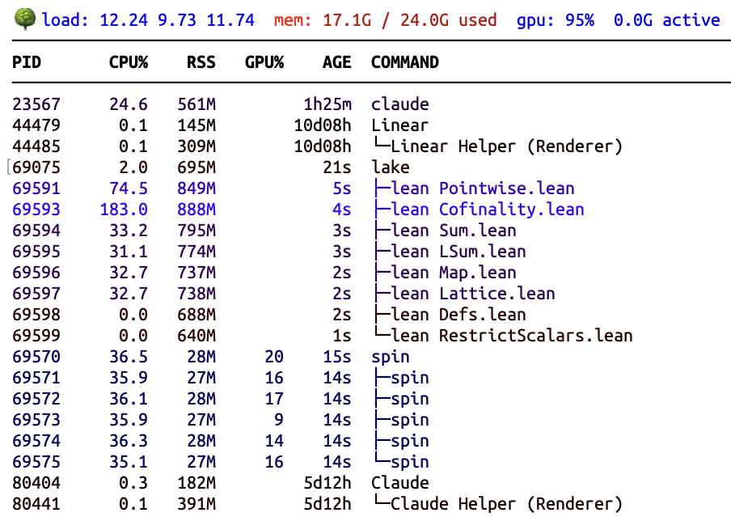
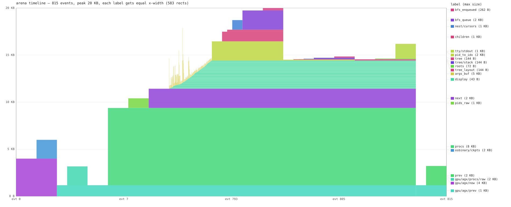

# ltop 🌳

[](https://github.com/girving/ltop/actions/workflows/linux-x86.yml)
[](https://github.com/girving/ltop/actions/workflows/linux-arm.yml)
[](https://github.com/girving/ltop/actions/workflows/mac-arm.yml)

Minimal process monitor (top replacement) in Rust. Designed for monitoring
builds (Lean/Lake, C++, etc.), GPU experiments, and similar workloads.
Screenshot:



Features:
- Tree-structured process display
- Per-process GPU usage column (NVIDIA on Linux, AGX on macOS) with no
  cover library linked — raw `/dev/nvidiactl` ioctls and raw IOKit MIG
- CPU and memory threshold filtering
- Interpreter-aware: shows script names for python, ruby, node, etc.
- Color-coded by CPU (blue) and memory (red) pressure
- Works on Linux and macOS

## Footprint

The shipped builds run libc-free static (Linux) or single-`LC_LOAD_DYLIB`
to libSystem only (mac); GPU monitoring is built in without dragging
the cover library into the link.

| Target | Binary | Startup RSS | Stable RSS |
|---|---:|---:|---:|
| Linux x86_64 | ≤ 23.8 KB | ~44 KB | ~44 KB |
| Linux aarch64 | ≤ 22.5 KB | ~44 KB | ~44 KB |
| macOS arm64 † | ≤ 32.6 KB | ~944 KB | ≤ 224 KB |

† macOS `phys_footprint` peaks transiently at ~944 KB during dyld init
while libSystem subdylibs load and libmalloc reserves zone arenas;
`mac_sys::unmap_idle_state` reclaims that state at the top of `main`
before the first tick fires, dropping to the 224 KB steady-state.
Of those 224 KB, ~160 KB is per-process page-table backing the dyld
shared cache, which `mach_vm_deallocate` can't actually clear (kernel
ignores deallocation of shared submap entries — see `CLAUDE.md`
"`mach_vm_deallocate` is a placebo on dyld-shared-cache submap
entries").

Linux has no equivalent transient peak: the libc-free static build
goes from kernel exec straight to `_start` to `main` with no library
init in between. The custom `_start` (`src/start.rs`) madvise-sweeps
the kernel-set argv/env stack pages within microseconds of process
bring-up, and the steady-state ~44 KB is reached effectively at t=0.

Binary size is asserted by `tests/footprint.rs` per-platform (CI
materialises the binary via `cargo ltop -- --check` before running
`cargo test --release`). RSS is host-dependent (page size, kernel
version, dyld shared cache layout) so the table values are documentary
rather than test-asserted; intentional changes to either column should
update README + the test threshold in the same commit.

The smallness is bought with `unsafe`: we use `#![no_std]` with a
custom `_start`, kernel calls are raw `svc`/`syscall` instructions,
formatting bypasses `core::fmt`, GPU and IOKit traffic is hand-encoded
MIG over hand-rolled Mach traps, and all working memory lives in one
512 KB bump arena instead of the heap (the global allocator aborts).
That is a great deal of `unsafe` atop kernel ABIs — raw syscall
wrappers, pointer-bumping arena internals, manual VM reclaim. The
arena's space-time profile for one macOS tick (peak 53 KB live of the
512 KB reservation) looks like:



Possibly there are bugs! All code was written by Claude Opus 4.6
through 4.8, so the fun question is whether Fable will find any bugs
once it comes back online. Seems like roughly a coin flip.

## Install

```bash
cargo ltop --install
```

Builds the minimal libc-free static binary (the one the footprint table
above documents) and copies it onto `$PATH` (the cargo install root —
`~/.cargo/bin` by default). The same command works on every supported
host — Linux x86_64/aarch64 and macOS aarch64 — picking the right
target spec under the hood. [rustup](https://rustup.rs) handles the
toolchain: `rust-toolchain.toml` pins nightly + `rust-src` and rustup
auto-installs them on first build.

Plain `cargo install --path .` can't produce this binary: the minimal
pipeline needs `-Z build-std` plus a custom per-arch target spec, and
the only ways to make `cargo install` pick those up are workspace-global
(they'd break `cargo test`). It still works, but yields a regular
release build (host libc, no static pipeline), so the footprint numbers
won't match. Prefer `cargo ltop --install` for the shipped binary.

## Usage

```bash
ltop          # interactive
ltop --once   # one frame and exit
```

Press `q` (or Ctrl-C) to quit.

To build-and-run straight from the repo without installing, use the
`cargo ltop` alias (same minimal pipeline):

```bash
cargo ltop                 # build + run
cargo ltop -- --once       # pass args after --
```
